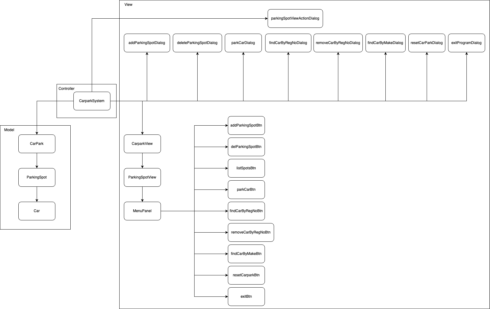

# Developer guide

The application is created using Java libraries AWT and Swing.

The application uses the Model, View, Controller architecture.

The diagram below illustrates the architecture of the Carpark System application

## Model

The application models handles all business logic such as adding or deleting parking spots and parking a car.

### CarPark

Manages a list of parking spots.

Stores list of parking spots in carpark and number of unoccupied parking spots.

Methods:

- getParkingSpots
- getNoUnoccupiedSpots
- addParkingSpot
- deleteParkingSpot
- parkCarInSpot
- findCarByRegNo
- removeCarByRegNo
- findCarByMake
- resetCarPark

### ParkingSpot

Models a parking spot in a carpark object.

Stores the ID of the parking spot and reference to car parked in the parking spot.

Methods:

- addCar
- removeCar
- getId
- isOccupied
- getParkedCar

### Car

Models a car

Stores details of the car and the time when it is parked.

Methods:

- getRegNo
- getMake
- getModel
- getYear
- getTimeStart
- getDurationOfParking

## View

Handles all display logic with respect to the GUI and user interactions.

View is updated whenever there is a change in its corresponding model.

### CarparkView

A JPanel subclass that displays all parking spots and its details.

### ParkingSpotView

A JButton subclass that displays details of the parking spot and its parked car (if any).

Background colour of ParkingSpotView changes with occupancy. Green -> Unoccupied, Red -> Occupied.

### TimerPanel

A JPanel subclass that displays the current time.

### MenuPanel

A JPanel subclass that displays all menu buttons available.

Each menu button is assigned a corresponding event listener that is defined in the controller class.

The event listeners for each button opens the corresponding dialog component that requires more user inputs. For e.g., addParkingSpotBtn has an event listener that opens the addParkingSpotDialog component.

### MenuButton

A JButton subclass that displays the button text with the styles defined.

### Dialogs

There are a total of 5 dialog classes:

3 multi-purpose dialogs:

- ActionDialog
- FormDialog
- MessageDialog

and 2 other dialogs that do not fit in the multi-purpose dialogs:

- ParkCarDialog, and
- ParkingSpotViewActionDialog.

Each dialog is a subclass of the JDialog class. The event listeners for the multi-purpose dialogs are defined in helper class DialogActionListeners.
All close buttons in dialogs have the same event listener, `e -> setVisible(false)`.

#### ActionDialog
Consists of a label, an action button and a close button.

Used to create action dialogs:
- resetCarParkDialog
- exitProgramDialog

#### FormDialog
Consists of a label, a text field, an action button and a close button.

Used to create single text field form dialogs:
- addParkingSpotDialog
- deleteParkingSpotDialog
- findCarByRegNoDialog
- removeCarByRegNoDialog
- findCarByMakeDialog

#### MessageDialog
Consists of a label and a close button.

Used to create info and error messages.

#### ParkCarDialog
Consists of 5 labels and text fields, and action button and a close button.

Used to get input from user for parking a car in a parking spot.

#### ParkingSpotViewActionDialog
An action dialog that consists of a variable number of action buttons shown depending on state of parking spot and a close button.

Dialog is opened when user clicks on a parking spot.

## Controller
The CarparkSystem class acts as the controller in this application. Action handlers are defined in the controller such as `removeCarByRegNoHandler` and `parkCarHandler`. 

The controller manages communication between model and view and makes sure that the model and the view are in sync.

## Event Listeners
### MenuPanel when MenuButton is clicked
Event listeners open the corresponding dialog component.

### Action Dialog
1. resetCarParkActionListener when `Reset` button is clicked
- Calls `controller.resetCarparkHandler()` which handles resetting the carpark
2. exitProgramActionListener when `Exit` button is clicked
- Calls `controller.exitProgramHandler()` which exits the application.

### FormDialog
1. addParkingSpotActionListener when `Add` button is clicked
2. deleteParkingSpotActionListener when `Delete` button is clicked
3. findByRegNoActionListener when `Find by registration number` button is clicked
4. removeByRegNoActionListener when `Remove by registration number` button is clicked
5. findByMakeActionListener when `Find by make` button is clicked

User input is validated and if valid, the corresponding handler in the controller is called to execute the action.
If input is invalid, error message is shown via MessageDialog.

### ParkCarDialog
Event listener validates all text inputs and if valid, calls `controller.parkCarHandler()`.
If input is invalid, error message is shown via MessageDialog.

### ParkingSpotViewActionDialog
1. addCarActionListener
   - Gets source parking spot ID and opens the parkCarDialog with the spot ID prefilled
2. removeCarActionListener
   - Gets source parking spot ID and calls `controller.removeCarRegNoHandler()`.
3. removeParkingSpotActionListener
   - Gets source parking spot ID and calls `controller.deleteParkingSpotHandler()`.

## Helper Classes
### DialogActionListeners
Stores action listeners that can be called via static functions.
### Validators
Stores user input validation functions that can be called via static functions.